		

**UNIVERSIDAD PRIVADA DE TACNA**

**FACULTAD DE INGENIERIA**

**Escuela Profesional de Ingeniería de Sistemas**

` `**Proyecto “Casa de Cambio en Línea”**

Curso: Calidad y Pruebas de Software

Docente: Patrick Cuadros Quiroga

Integrantes:

***Chambi Cori , Jerson Roni	(2021072619)***

***Flores Quispe, Jaime Elias	(2021070309)***

***Leyva Sardon, Elvis Ronald	(2021072614)***

**Tacna – Perú**

***2024***

|CONTROL DE VERSIONES||||||
| :-: | :- | :- | :- | :- | :- |
|Versión|Hecha por|Revisada por|Aprobada por|Fecha|Motivo|
|1\.0|MPV|ELV|ARV|10/10/2020|Versión Original|

**Sistema *{Casa de Cambio en Línea}***

**Documento de Arquitectura de Software**

**Versión *{1.0}***

INDICE GENERAL

**Contenido**

[***1.***](#_30j0zll)***INTRODUCCIÓN	5******

[**1.1.**](#_1fob9te)**Propósito (Diagrama 4+1)	5**

[**1.2.**](#_3znysh7)**Alcance	5**

[**1.3.**](#_2et92p0)**Definición, siglas y abreviaturas	5**

[**1.4.**](#_tyjcwt)**Organización del documento	5**

[***2.***](#_3dy6vkm)***OBJETIVOS Y RESTRICCIONES ARQUITECTONICAS	5***

[2.1.1.](#_1t3h5sf)Requerimientos Funcionales	5

[2.1.2.](#_2s8eyo1)Requerimientos No Funcionales – Atributos de Calidad	5

[***3.***](#_17dp8vu)***REPRESENTACIÓN DE LA ARQUITECTURA DEL SISTEMA	6***

[**3.1.**](#_26in1rg)**Vista de Caso de uso	6**

[3.1.1.](#_lnxbz9)Diagramas de Casos de uso	6

[**3.2.**](#_35nkun2)**Vista Lógica	6**

[3.2.1.](#_44sinio)Diagrama de Subsistemas (paquetes)	7

[3.2.2.](#_2jxsxqh)Diagrama de Secuencia (vista de diseño)	7

[3.2.3.](#_z337ya)Diagrama de Colaboración (vista de diseño)	7

[3.2.4.](#_3j2qqm3)Diagrama de Objetos	7

[3.2.5.](#_1y810tw)Diagrama de Clases	7

[3.2.6.](#_4i7ojhp)Diagrama de Base de datos (relacional o no relacional)	7

[**3.3.**](#_2xcytpi)**Vista de Implementación (vista de desarrollo)	7**

[3.3.1.](#_1ci93xb)Diagrama de arquitectura software (paquetes)	7

[3.3.2.](#_3whwml4)Diagrama de arquitectura del sistema (Diagrama de componentes)	7

[**3.4.**](#_qsh70q)**Vista de procesos	7**

[3.4.1.](#_3as4poj)Diagrama de Procesos del sistema (diagrama de actividad)	8

[**3.5.**](#_1pxezwc)**Vista de Despliegue (vista física)	8**

[3.5.1.](#_49x2ik5)Diagrama de despliegue	8

[***4.***](#_2bn6wsx)***ATRIBUTOS DE CALIDAD DEL SOFTWARE	8***

[**Escenario de Funcionalidad	8**](#_2p2csry)

[**Escenario de Usabilidad	8**](#_147n2zr)

[**Escenario de confiabilidad	9**](#_3o7alnk)

[**Escenario de rendimiento	9**](#_23ckvvd)

[**Escenario de mantenibilidad	9**](#_ihv636)

[**Otros Escenarios	9**](#_32hioqz)

1. INTRODUCCIÓN

1. Propósito (Diagrama 4+1)

- ## **Vista Lógica (Diagrama de Clases):**
  - Representar la estructura conceptual de la plataforma de cambio de divisas en línea.
  - Mostrar las clases principales del sistema y sus relaciones para entender cómo se organizan los datos y las funcionalidades del sistema.
  - Ejemplo: Clases como Usuario, Transacción, Método de Pago, etc.
- ## **Vista de Procesos (Diagrama de Secuencia):**
  - Detallar la interacción entre los actores y el sistema durante procesos clave, como el registro de usuarios, consulta de tasas de cambio, y realización de transacciones.
  - Clarificar el flujo de actividades y las comunicaciones entre componentes del sistema.
  - Ejemplo: Secuencias de interacción entre Usuario y Sistema para realizar una transacción.
- ## **Vista Física (Diagrama de Despliegue):**
  - Describir cómo se distribuyen los componentes físicos o lógicos del sistema en el entorno de despliegue.
  - Indicar cómo se conectan los servidores, bases de datos y otros elementos tecnológicos para soportar la plataforma.
  - Ejemplo: Despliegue de la aplicación web en servidores de nube con bases de datos distribuidas.
- ## **Vista de Escenarios (Casos de Uso):**
  - Identificar los diferentes roles de usuarios y sus interacciones con el sistema a través de casos de uso detallados.
  - Mostrar cómo los usuarios utilizan la plataforma para realizar acciones específicas como registrarse, consultar tasas de cambio, y realizar transacciones.
  - Ejemplo: Casos de uso para Usuario Registrado, Administrador del Sistema, y Soporte al Cliente.

- ## **Vista de Diseño (Diagrama de Componentes):**
  - Representar los componentes físicos y lógicos del sistema y cómo se relacionan para cumplir con los requisitos funcionales y no funcionales.
  - Mostrar la estructura interna del sistema, incluyendo módulos, servicios y APIs utilizadas.
  - Ejemplo: Componentes como Interfaz de Usuario, Servicios de Seguridad, y Servidores de Aplicaciones.

Por ende estos diagramas proporcionan una visión integral y detallada del sistema de Casa de Cambio en Línea, facilitando la comprensión y comunicación entre desarrolladores, arquitectos y otros stakeholders involucrados en el proyecto.

1. Alcance

El informe se centrará en proporcionar una visión integral y detallada del sistema de Casa de Cambio en Línea, abordando los siguientes aspectos clave:
- ## **Descripción General del Proyecto:**
  - Introducción detallada al sistema "Casa de Cambio en Línea", incluyendo su propósito, objetivos y beneficios esperados tanto para usuarios como para la empresa.

- ## **Visión y Misión:**
  - Presentación de la visión y misión del proyecto, destacando el objetivo de liderar el mercado de cambio de divisas en línea mediante una plataforma segura, transparente y fácil de usar.

- ## **Análisis del Contexto y Problemas a Resolver:**
  - Análisis de los desafíos actuales en el mercado de cambio de divisas en línea, destacando las dificultades enfrentadas por los usuarios y la falta de transparencia en los servicios existentes.

- ## **Objetivos del Negocio y Diseño:**
  - Explicación detallada de los objetivos del negocio, que incluyen facilitar el intercambio de divisas de manera segura y eficiente, mejorar la accesibilidad y transparencia, y fomentar relaciones sólidas con los clientes.
  - Descripción de los objetivos de diseño, enfocados en desarrollar una plataforma intuitiva y segura que garantice la confidencialidad de la información financiera y personal de los usuarios.

- ## **Especificación de Requerimientos de Software:**
  - Cuadro detallado de los requisitos funcionales y no funcionales del sistema, incluyendo desde el registro de usuarios hasta la gestión de transacciones y la seguridad de la plataforma.
  - Identificación y explicación de los requisitos clave como la autenticación de usuarios, consulta de tasas de cambio, realización de transacciones y soporte al cliente.

- ## **Diagrama 4+1:**
  - Propósito y detalle de los diagramas 4+1 utilizados en el informe, explicando cómo cada vista (lógica, de procesos, física, de escenarios y de diseño) contribuye a la comprensión global del sistema de Casa de Cambio en Línea.
  - Ejemplos específicos de cada tipo de diagrama aplicados al contexto del proyecto.

- ## **Viabilidad del Sistema:**
  - Evaluación de la viabilidad técnica y económica del proyecto, demostrando cómo se utilizarán tecnologías avanzadas para garantizar la funcionalidad y estabilidad del sistema, así como asegurar un retorno positivo de la inversión.

- ## **Levantamiento de Información y Conclusión:**
  - Resumen de los datos esenciales obtenidos durante el levantamiento de información, destacando las necesidades y preferencias del mercado.
  - Conclusión que sintetice los hallazgos clave y proponga recomendaciones para el desarrollo futuro del sistema de Casa de Cambio en Línea.

Es así que alcance asegura que el informe sea completo, detallado y orientado a proporcionar una comprensión clara y profunda del proyecto de Casa de Cambio en Línea, abordando tanto los aspectos técnicos como estratégicos necesarios para su éxito.

\* 

1. Definición, siglas y abreviaturas
\*

**RF**: Requerimiento Funcional

   **RNF**: Requerimiento No Funcional

   **API**: Interfaz de Programación de Aplicaciones

   **BD**: Base de Datos

   **UI**: Interfaz de Usuario (User Interface)

   **CPU**: Unidad Central de Procesamiento (Central Processing Unit)

   **RAM**: Memoria de Acceso Aleatorio (Random Access Memory)

   **HTTPS**: Protocolo seguro de transferencia de hipertexto (Hypertext Transfer Protocol Secure)

   **URL**: Localizador Uniforme de Recursos (Uniform Resource Locator)

   **DNS**: Sistema de Nombres de Dominio (Domain Name System)

   **HTML**: Lenguaje de Marcado de Hipertexto (Hypertext Markup Language)

   **CSS**: Hojas de Estilo en Cascada (Cascading Style Sheets)

   **SSL/TLS**: Capa de sockets seguros / Protocolo de Seguridad de la Capa de Transporte (Secure Sockets Layer / Transport Layer Security)

   **VPN**: Red Privada Virtual (Virtual Private Network)

   **API REST**: Interfaz de Programación de Aplicaciones Representacional (Representational State Transfer)

   **JSON**: Notación de Objetos JavaScript (JavaScript Object Notation)

   **XML**: Lenguaje de Marcado Extensible (eXtensible Markup Language)

1. Organización del documento

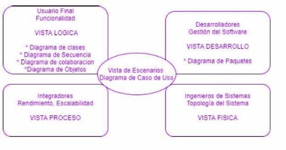

1. # **OBJETIVOS Y RESTRICCIONES ARQUITECTONICAS**
   [Establezca las prioridades de los requerimientos y las restricciones del proyecto)

   1. Priorización de requerimientos

      1. Requerimientos Funcionales

|**ID**|**Requerimiento Funcional**|**Descripción**|**Prioridad**|
| :- | :- | :- | -: |
|

RF1
|

Registro de Usuario
|
Los usuarios deben poder registrarse en la plataforma proporcionando información básica como nombre, dirección de correo

electrónico y contraseña.
|

Alta
|
|

RF2
|

Autenticación de Usuario
|Los usuarios registrados deben poder iniciar sesión en sus cuentas utilizando un nombre de usuario y contraseña seguros.|

Alta
|
|

RF3
|

Consulta de Tasas de Cambio
|Los usuarios deben poder consultar las tasas de cambio actualizadas entre diferentes pares de divisas.|

Alta
|
|

RF4
|

Realización de Transacciones
|
Los usuarios deben poder realizar transacciones de cambio de divisas de manera segura y eficiente, eligiendo entre

diferentes métodos de pago aceptados.
|

Alta
|
|

RF5
|

Historial de Transacciones
|
Los usuarios deben tener acceso a un historial detallado de todas las transacciones  de  cambio  de  divisas

realizadas en la plataforma.
|

Alta
|
|

RF6
|

Notificaciones y Alertas
|
La plataforma debe ser capaz de enviar notificaciones y alertas relevantes a los usuarios, como confirmaciones de transacciones y cambios en las tasas de

cambio.
|

Medio
|

|

RF7
|

Soporte al Cliente
|
Debe existir un sistema de soporte al cliente accesible para ayudar a los usuarios con consultas, problemas técnicos o cualquier otro tipo de asistencia relacionada con las transacciones de

cambio de divisas.
|

Bajo
|
| :- | :- | :-: | :- |

1. Requerimientos No Funcionales - Atributos de Calidad
   *
 

|

**ID**
|
**Requerimiento No**

**Funcional**
|

**Descripción**
|

**Prioridad**
|
| :- | :- | :- | :- |
|

RNF 1
|

Usabilidad
|
La plataforma debe ser fácil de usar y navegar, con una interfaz intuitiva que permita a los usuarios encontrar rápidamente la información que necesitan y

realizar acciones sin dificultad.
|

Alta
|
|

RNF 2
|

Rendimiento
|
La plataforma debe ser rápida y eficiente, con tiempos de carga cortos y respuesta inmediata a las acciones del usuario, incluso en momentos de alta

demanda.
|

Alta
|
|

RNF 3
|

Disponibilidad
|
La plataforma debe estar disponible las 24 horas del día, los 7 días de la semana, con un tiempo de inactividad mínimo planificado para mantenimiento y

actualizaciones.
|

Alta
|
|

RNF 4
|

Seguridad
|
Se deben implementar medidas de seguridad robustas para proteger la información personal y financiera de los usuarios, incluyendo encriptación de datos, autenticación de dos factores y protección contra

ataques cibernéticos.
|

Alta
|
|

RNF 5
|

Escalabilidad
|
La plataforma debe ser capaz de manejar un alto volumen de usuarios y alojamientos, con la capacidad de escalar vertical u horizontalmente

según sea necesario para satisfacer la demanda.
|

Medio
|
|

RNF 6
|

Adaptabilidad
|

La plataforma debe ser adaptable a diferentes dispositivos y tamaños de pantalla, incluyendo computadoras de escritorio, tabletas y dispositivos móviles, garantizando una experiencia consistente en todas las plataformas.
|

Alta
|
|

RNF 7
|

Cumplimiento Legal
|
La plataforma debe cumplir con todas las leyes y regulaciones aplicables en materia de protección de datos, privacidad del usuario, derechos de autor y cualquier otra normativa relevante en las

jurisdicciones en las que opera.
|

Medio
|

1. Restricciones

1. **Restricciones Técnicas**
   0. **Tecnologías Específicas**: El sistema debe desarrollarse utilizando tecnologías específicas como Java para el backend, Angular para el frontend y MySQL como base de datos.
   0. **Compatibilidad de Navegadores**: La plataforma debe ser compatible con los navegadores más utilizados como Chrome, Firefox, Safari y Edge.
   0. **Integración de APIs**: Se deben integrar APIs externas para obtener tasas de cambio actualizadas en tiempo real.
   0. **Seguridad**: Uso obligatorio de SSL/TLS para garantizar comunicaciones seguras entre el cliente y el servidor.
   0. **Escalabilidad**: El sistema debe estar diseñado para escalar horizontalmente para soportar un aumento en el número de usuarios y transacciones.

1. **Restricciones de Desarrollo**
   0. **Plazo de Entrega**: El desarrollo del sistema debe completarse en un plazo de 6 meses desde el inicio del proyecto.
   0. **Presupuesto**: El presupuesto total asignado para el desarrollo del sistema no debe exceder los 100,000 euros.
   0. **Recursos Humanos**: El equipo de desarrollo estará compuesto por un máximo de 5 desarrolladores, 1 arquitecto de software, y 2 testers.

1. **Restricciones Legales y de Cumplimiento**
   0. **Regulaciones Financieras**: El sistema debe cumplir con todas las regulaciones financieras aplicables en los países donde operará, incluyendo normativas de anti-lavado de dinero (AML) y Conozca a su Cliente (KYC).
   0. **Protección de Datos**: Cumplimiento obligatorio con el Reglamento General de Protección de Datos (GDPR) de la UE para proteger la información personal de los usuarios.
   0. **Auditorías**: La plataforma debe permitir la realización de auditorías periódicas por entidades reguladoras.

1. **Restricciones de Operación**
   0. **Soporte Técnico**: Se debe proporcionar soporte técnico a los usuarios durante el horario comercial estándar.
   0. **Backup y Recuperación**: Implementación de un sistema de backup y recuperación de datos que permita la restauración completa en un máximo de 4 horas en caso de fallo.
   0. **Disponibilidad**: El sistema debe garantizar una disponibilidad mínima del 99.9%, con un tiempo máximo de inactividad de 8.76 horas al año.

1. **Restricciones de Usabilidad**
   0. **Interfaz de Usuario**: La interfaz de usuario debe ser intuitiva y accesible, cumpliendo con las directrices de accesibilidad WCAG 2.1.
   0. **Multilenguaje**: La plataforma debe estar disponible al menos en español e inglés.

1. # **REPRESENTACIÓN DE LA ARQUITECTURA DEL SISTEMA**

1. Vista de Caso de uso

1. ### Diagramas de Casos de uso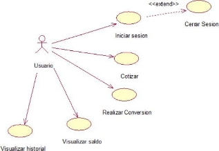

1. Vista Lógica
   1. ### Diagrama de Subsistemas (paquetes)
      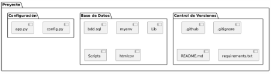
   1. ### Diagrama de Secuencia (vista de diseño)

Diagrama de Secuencia para Gestionar Usuarios

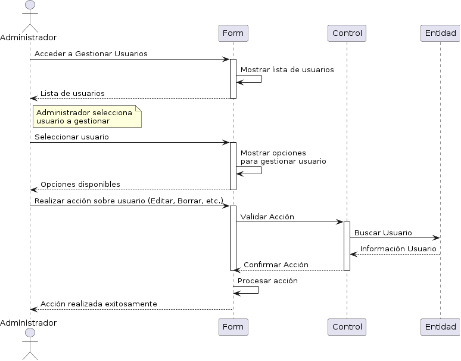

Diagrama de Secuencia para Gestionar Monedas

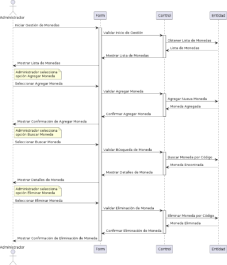

Diagrama de Secuencia para Gestionar Tasas de Cambio

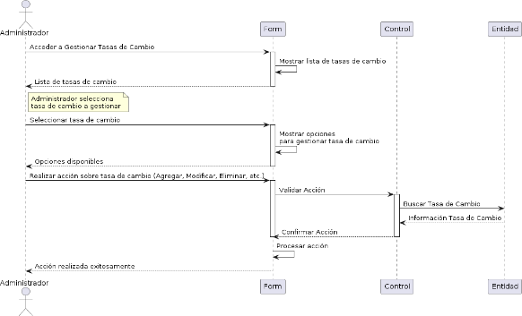

Diagrama de Secuencia para Cliente realizando una conversión

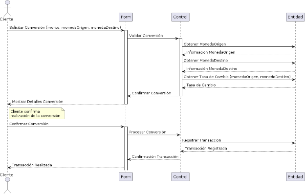

Diagrama de Secuencia: Cliente Consultando su Historial de Transacciones

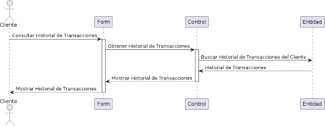

Diagrama de Secuencia: Cliente Consultando Saldo

Diagrama de Secuencia: Administrador actualiza Tasa de Cambio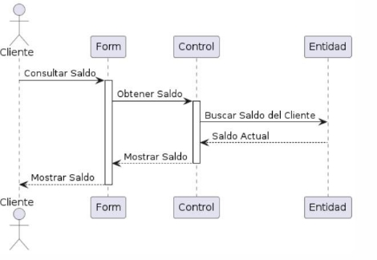

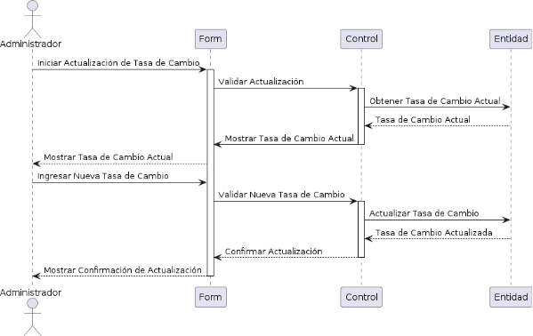

1. ### Diagrama de Colaboración (vista de diseño)

1. ### Diagrama de Objetos

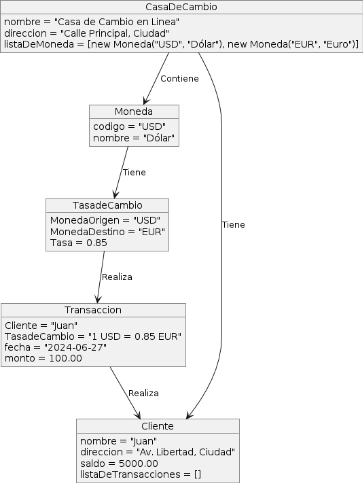

1. ### Diagrama de Clases

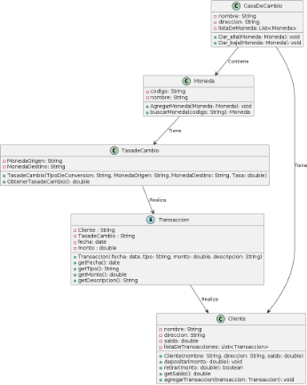

1. ### Diagrama de Base de datos

Modelo lógico

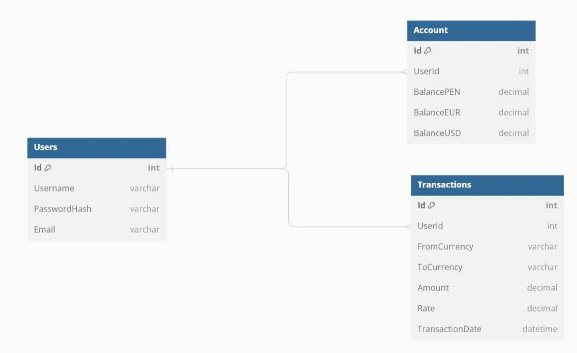

Modelo físico

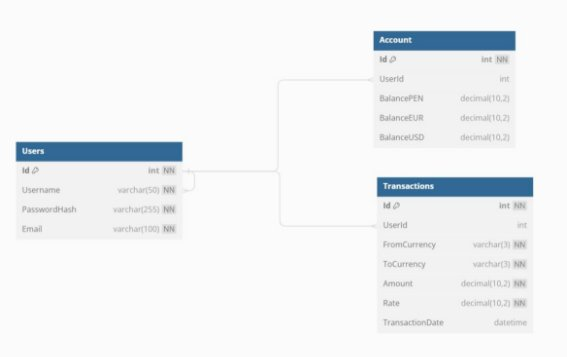

1. Vista de Implementación (vista de desarrollo)

   1. ### Diagrama de arquitectura software (paquetes)
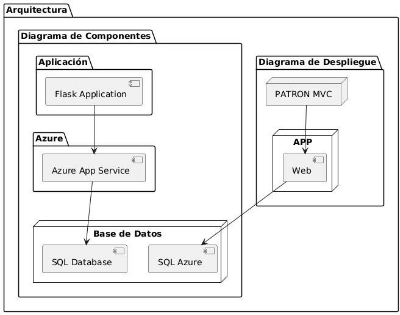

**Descripción del Diagrama de Arquitectura de Software**

**Paquetes:**

- Casa de Cambio en Línea: El contenedor principal de la aplicación.
- Capa de Vista: Representa la capa de presentación o interfaz de usuario.
- Capa de Modelo: Representa la capa de datos, incluyendo modelos y lógica de negocio.
- Capa de Controlador: Representa la capa de lógica de control, que maneja las solicitudes de la vista y actúa sobre el modelo.

**Relaciones:**

- Capa de Controlador a Capa de Modelo: La capa de controlador accede a la capa de modelo para consultar o actualizar datos.
- Capa de Vista a Capa de Controlador: La capa de vista envía solicitudes a la capa de controlador para manejar la interacción del usuario.
  1. ### Diagrama de arquitectura del sistema (Diagrama de componentes)

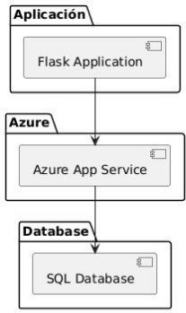

Componentes Principales:

- Los componentes de la Capa de Vista solicitan servicios a la Capa de Controlador.
- La Capa de Controlador interactúa con la Capa de Modelo para realizar operaciones de datos.
- SwaggerUI documenta los endpoints manejados por los controladores.
- ConversionAPI proporciona servicios específicos a los controladores de transacciones y cuentas.
1. # **ATRIBUTOS DE CALIDAD DEL SOFTWARE**
##
## **Escenario de Funcionalidad**
**Descripción**: El objetivo de este escenario es garantizar que el sistema cumpla con las funcionalidades esperadas y definidas. Para ello, se ejecutaron pruebas unitarias y de integración, así como pruebas BDD que cubren los casos más críticos del sistema.

**Resultados**:

- Las **pruebas unitarias** mostraron un nivel de cobertura del 86%, lo que garantiza que una parte significativa del código esté validado. Algunos archivos clave, como currency\_manager.py y transaction\_manager.py, tienen una cobertura del 100%, lo que refleja que las funciones más críticas están adecuadamente probadas.
- Las **pruebas BDD** también reflejaron una alta tasa de éxito, con 4 características aprobadas y 15 escenarios que pasaron sin problemas, asegurando que las funcionalidades clave del sistema, como la creación de cuentas y la actualización de información de usuario, funcionan como se espera.

**Conclusión**: La cobertura de pruebas y los resultados de las pruebas BDD aseguran que el software cumple con los requisitos funcionales establecidos, aunque se puede mejorar la cobertura en áreas específicas del código.

- **Sugerencia**: **Incluir imagen o reporte de cobertura de pruebas unitarias** para ilustrar el porcentaje alcanzado y mostrar cómo se distribuye la cobertura entre los diferentes archivos.
## **Escenario de Usabilidad**
**Descripción**: Este escenario evalúa la facilidad de uso y la experiencia de usuario, asegurando que el software sea intuitivo y fácil de interactuar.

**Resultados**:

- Se realizaron **pruebas de interfaz de usuario** para validar aspectos clave, como la conversión de montos, la cotización y el inicio de sesión. Todas las pruebas fueron aprobadas con éxito y con tiempos de respuesta adecuados.
- Ejemplos de pruebas exitosas incluyen la validación de formularios vacíos, la no aceptación de montos negativos, y la verificación de errores de valor nulo. Además, las pruebas de cotización y de inicio de sesión también fueron completadas sin fallas.

**Conclusión**: Las pruebas de interfaz demuestran que el sistema es fácil de usar, y las interacciones se completan de manera eficiente y sin errores. La experiencia de usuario es positiva, lo que contribuye a la **usabilidad**.

- **Sugerencia**: **Incluir imágenes o capturas de pantalla de las pruebas de interfaz** que muestran las interacciones y los mensajes de error.

## **Escenario de Confiabilidad**
**Descripción**: Este escenario se enfoca en garantizar que el sistema funcione sin fallos y de manera consistente bajo condiciones normales de operación.

**Resultados**:

- Las pruebas de **mutantes** indican que las pruebas unitarias tienen una efectividad de "asesinato" del 76.69%, lo que significa que las pruebas están bien diseñadas para detectar errores.
- Las **pruebas BDD** también verificaron que las funcionalidades clave, como la creación de cuentas y las transacciones, se ejecutaron correctamente sin errores. Se manejaron adecuadamente las situaciones excepcionales, como la consulta de cuentas inexistentes, lo que contribuye a la confiabilidad del sistema.

**Conclusión**: El sistema ha demostrado ser confiable tanto en pruebas funcionales como en pruebas de mutantes, lo que garantiza que las funcionalidades principales están libres de errores en condiciones normales.

- **Sugerencia**: **Incluir los resultados de la prueba de mutantes**, especialmente la efectividad de "asesinato", para reforzar la evaluación de confiabilidad.
## **Escenario de Rendimiento**
**Descripción**: El rendimiento del sistema se mide evaluando la velocidad y la eficiencia de las operaciones, como tiempos de respuesta y consumo de recursos.

**Resultados**:

- Las **pruebas BDD** reflejan tiempos de respuesta muy rápidos en operaciones clave, como la actualización de información de usuario (1ms) y la creación de cuentas (menos de 1 segundo). Además, las **pruebas de interfaz** mostraron tiempos de carga razonables para la página de cotización (4.6 segundos) y para las transacciones.
- Todas las pruebas de funcionalidad relacionadas con las conversiones y el inicio de sesión se ejecutaron rápidamente, lo que sugiere que el sistema maneja las operaciones de manera eficiente.

**Conclusión**: El sistema muestra un excelente rendimiento en términos de tiempos de respuesta y eficiencia operativa, lo que es un indicador positivo para el uso en un entorno de producción.

- **Sugerencia**: **Incluir métricas de tiempo de respuesta de las pruebas BDD y de interfaz** para dar evidencia visual del rendimiento.

## **Escenario de Mantenibilidad**
**Descripción**: La mantenibilidad se evalúa observando qué tan fácil es realizar cambios, corregir errores y extender el sistema sin causar problemas adicionales.

**Resultados**:

- Las **pruebas unitarias** cubren la mayoría del código (86%) y algunos archivos específicos tienen una cobertura del 100%, lo que facilita futuras modificaciones y asegura que las funciones esenciales estén correctamente validadas.
- Las **pruebas de mutantes** muestran que las pruebas unitarias pueden detectar la mayoría de los errores introducidos, aunque hay áreas con una menor eficiencia (como test\_transaction\_manager.py con una eficiencia de 47.37%).

**Conclusión**: El sistema es altamente mantenible debido a la cobertura de pruebas amplia y la capacidad para detectar errores de manera efectiva. Aún hay áreas donde se pueden mejorar las pruebas para una cobertura más completa.

##

